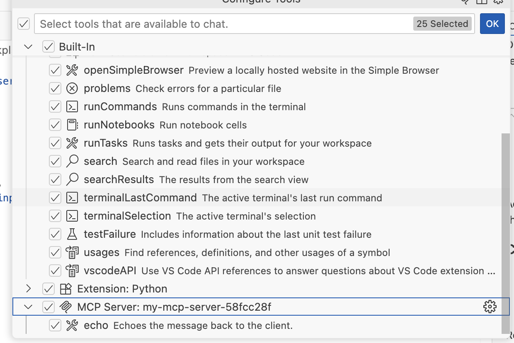
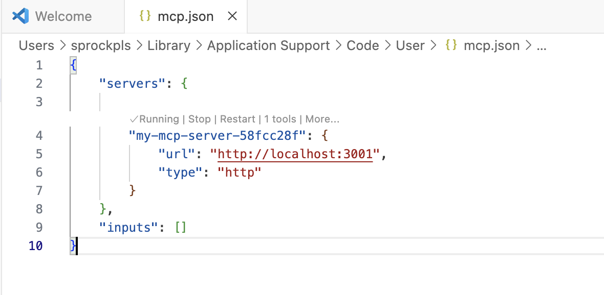

# First MCP

## Learnings
* Seems like Anti gravity doesn't like local MCP Servers, I assume it needs to be deployed
* C# is easier to get running compared to javascript. 
* ChatGPT doesn't have MCP support, even the ChatGPT desktop mode
* VS Code has the easiest MCP support
* Tool = endpoint
* Make sure your MCP Server is running, and the MCP Server in mcp.json is running
* MCP inspector made life a lot easier https://github.com/modelcontextprotocol/inspector 